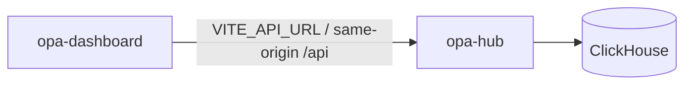

# Architecture

The dashboard never lists or calls edge `opa-agent` URLs. Edge agents push telemetry to the hub; the UI queries the hub only. There is no peer-mesh federation UI — multi-host visibility is through the hub registry and ingest path.

Code review, AppSec inventory, and load-test UIs ship as separate products (ORA, OSA, OPL).

## The time range is a per-route capability

`hooks/useApi.js` merges `from`, `to` and `interval` into every request that does
not opt out with `noRange`. That opt-out is the real record of which screens the
range applies to: catalogue, alerting, infrastructure inventory, the query
editor, dashboards and every administration screen pass `noRange` on all of their
requests, because the hub handlers behind them do not window on those parameters.

So the range switch in the top bar is not global. `nav.js` marks each destination
that genuinely consumes the range with `timeRange: true`, and
`routeHasTimeRange(pathname)` resolves it for the active route —  exact rail
matches answer from their own flag, deeper paths inherit their parent unless
`DETAIL_TIME_RANGE` overrides them (a single trace and a single error are
absolute records, so they opt out). `components/shell/Shell.jsx` renders the
switch only where the flag is set. It used to render everywhere, including
Settings, where nothing read it.

Two things are deliberately *not* coupled to the flag:

- **Refresh stays on every route.** Any page can be re-fetched, and the tick it
  raises is what peer products consume the provider for.
- **`TimeRangeProvider` stays mounted on every route.** `useApi` reads the tick
  from it, so unmounting it to hide a control would stop polling. Hiding the
  switch is a presentation change and nothing more.

Adding a route means deciding this once: an unflagged route answers `false`, so a
new screen has to opt in rather than inherit a control by accident. The
assertions live in `src/nav.timeRange.test.js` (the classification) and
`src/components/shell/Shell.timeRange.test.jsx` (the chrome obeying it).
