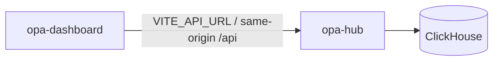

# Architecture

The dashboard never lists or calls edge `opa-agent` URLs. Edge agents push telemetry to the hub; the UI queries the hub only. There is no peer-mesh federation UI — multi-host visibility is through the hub registry and ingest path.

Code review, AppSec inventory, and load-test UIs ship as separate products (ORA, OSA, OPL).
